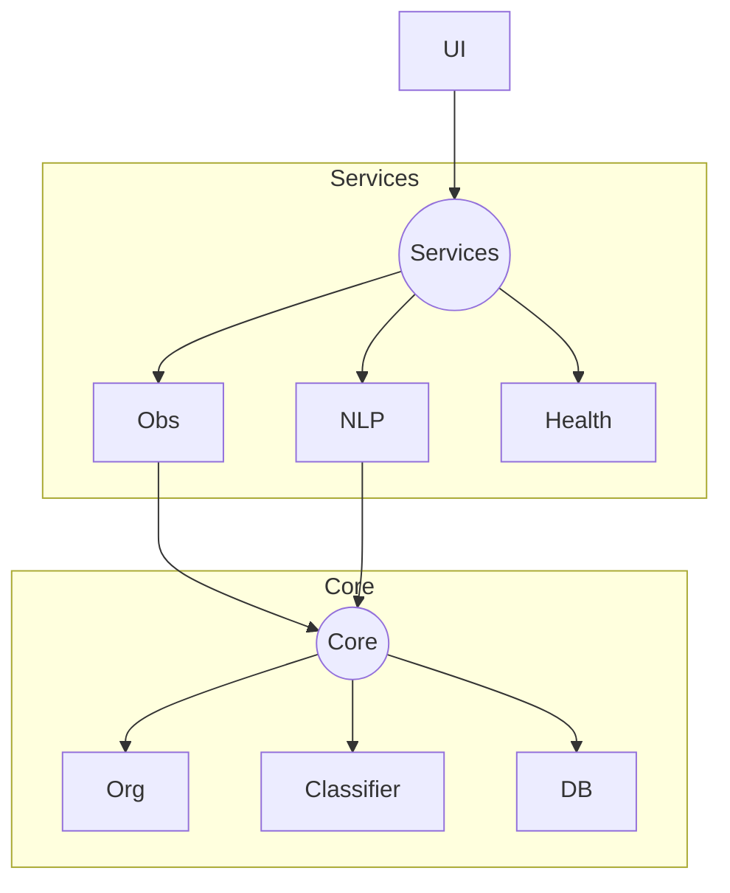

# FileManager → Agentic FileManager


> **The upgrade story lives in [`docs/`](docs/README.md)** — honest audit with evidence, the old-vs-new transformation, the agentic architecture ("File Council"), and a screen-recording demo script.
>
> 1. [00 — Origin](docs/00-origin.md) · where this project came from
> 2. [01 — Audit](docs/01-audit.md) · the truth about the old system (file:line evidence)
> 3. [02 — Old vs New](docs/02-old-vs-new.md) · the transformation pitch
> 4. [03 — Agentic Architecture](docs/03-agentic-architecture.md) · the File Council design
> 5. [04 — Ease-of-Life Features](docs/04-ease-of-life.md) · what's added & why
> 6. [05 — Roadmap](docs/05-roadmap.md) · phased, testable implementation plan
> 7. [06 — Demo Script](docs/06-demo-script.md) · interview screen-recording guide

---

## About

FileManager Pro is a production-grade Python application that reimagines file management through automation and intelligent organization. Built from the ground up to address real-world filesystem challenges, it combines a robust background monitoring engine with a modern interface to provide a set-and-forget solution for keeping directories organized.

At its core, FileManager Pro solves a common problem: manual file organization is tedious, error-prone, and doesn't scale. Whether you're managing downloads, project files, or media libraries, this tool automatically categorizes, monitors, and maintains your filesystem based on customizable rules. The natural language interface allows you to query and control your files conversationally, while the intelligent cleanup system identifies duplicates, orphaned files, and other inefficiencies that accumulate over time.

The project emphasizes production-ready engineering practices: modular architecture, comprehensive error handling, safe file operations with dry-run capabilities, and resilient execution even in edge cases like locked files or infinite event loops. It's designed for users who need reliability and developers who value clean, maintainable code.

---

## Table of Contents

- [Architecture](#️-architecture)
- [Technical Stack](#-technical-stack)
- [Engineering Challenges & Solutions](#-engineering-challenges--solutions)
  - [Race Conditions with File Locks](#1-race-conditions-with-file-locks)
  - [PyInstaller Packaging Issues](#2-pyinstaller-packaging-issues)
  - [Infinite Event Loops](#3-infinite-event-loops)
  - [Configuration Corruption](#4-configuration-corruption)
- [Quick Start](#-quick-start)
- [Key Features](#-key-features)
- [Contributing](#-contributing)
- [License](#-license)

---

## 🏗️ Architecture

FileManager follows a modular Service-Oriented Architecture (SOA) with clear separation of concerns:



### Layer Breakdown

- **`src/services/`** - Singleton managers handling configuration, logging, and file observation
- **`src/core/`** - Pure business logic for file operations, hashing, and NLP parsing
- **`src/gui/`** - View components built with `customtkinter`, decoupled from business logic

---

## 🔧 Technical Stack

- **File Monitoring**: `watchdog` for real-time filesystem events
- **NLP Processing**: `spaCy` with `en_core_web_sm` model
- **Data Persistence**: `SQLite` for metadata and query history
- **UI Framework**: `customtkinter` for modern dark-mode interface
- **File Integrity**: SHA-256 hashing for duplicate detection

---

## 💡 Engineering Challenges & Solutions

### 1. Race Conditions with File Locks

**Problem**: Browser downloads create temporary files (`.crdownload`) that are locked during the download process. Attempting to move these files immediately caused crashes.

**Solution**: `observer.py` gates every move behind a real readiness check: temporary suffixes (`.crdownload`, `.part`, `.tmp`, ...) are skipped outright, files that fail to open (locked by another process) are retried, and a file is only moved once its size is stable across two samples — no fixed-sleep guesswork.

```python
# Simplified example
def _is_ready(self, file_path, retries=5, delay=0.2):
    for _ in range(retries):
        if not file_path.exists():
            return False
        if file_path.suffix.lower() in TEMP_SUFFIXES:
            time.sleep(delay); continue
        try:
            with file_path.open("rb"):
                pass
            size_1 = file_path.stat().st_size
            time.sleep(delay)
            if file_path.stat().st_size == size_1:
                return True
        except (PermissionError, OSError):
            time.sleep(delay)
    return False
```

### 2. Packaging & Cross-Platform Paths

**Problem**: The app depended on its working directory for `config.json` and log files (audit [H4](docs/01-audit.md)). Launched from anywhere else — or as a packaged EXE — it silently wrote state to the wrong place.

**Solution**: All application state now resolves through `platformdirs` to OS-standard user directories: config → `user_config_dir("FileManager")`, logs → `user_log_dir("FileManager")`, database/journal → `user_data_dir("FileManager")` ([ADR-014](docs/decisions/ADR-014-cross-platform-platformdirs.md)). A one-time migration copies a legacy CWD-relative `config/config.json` if present. `build_exe.bat` bundles with a plain onefile PyInstaller build; the heavyweight spaCy bundling config is deliberately **not** maintained because the 700MB model is slated for removal (audit [M1](docs/01-audit.md), roadmap Step 4).

### 3. Infinite Event Loops

**Problem**: Moving a file triggered a "File Modified" event, which triggered another move operation, creating an infinite recursion loop.

**Solution**: The `DownloadHandler` processes `on_created` and `on_moved` events (the moves a watcher actually cares about), and a file already sitting in its destination category folder is indexed and skipped rather than moved again — so no event chain can feed back into a second move.

```python
def on_created(self, event):
    if event.is_directory:
        return
    self._process_file(Path(event.src_path))

def _process_file(self, file_path):
    category = classifier.classify(file_path)
    target_dir = file_path.parent / category
    if file_path.parent.name == category:   # already home → index only
        db_service.upsert_file(file_path)
        return
```

### 4. Configuration Corruption

**Problem**: The cleanup command accidentally overwrote the entire `config.json` with a partial dictionary, destroying user settings.

**Solution**: `config_service` never trusts a loaded file wholesale. `_validate_and_merge` merges the loaded JSON on top of `DEFAULT_CONFIG` with per-key type validation (wrong-typed keys fall back to defaults), and `save_config` is the only persisted write path. Since Step 2, the file carries a `schema_version` that `_apply_schema_migrations` upgrades in place ([F9](docs/01-audit.md)).

```python
# src/services/config_service.py (simplified)
def _validate_and_merge(self, loaded):
    merged = DEFAULT_CONFIG.copy()
    for key, value in loaded.items():
        if key in DEFAULT_CONFIG:
            # Basic type validation: wrong-typed keys fall back to defaults
            if isinstance(value, type(DEFAULT_CONFIG[key])):
                merged[key] = value
    return merged

def save_config(self, new_config):
    with open(self._config_path, "w") as f:
        json.dump(new_config, f, indent=4)
    self.config = new_config
```

---

## 🚀 Quick Start

### Running from Source

```bash
# Clone the repository
git clone https://github.com/MohamedGhoniem11/FileManager
cd FileManager

# Install dependencies
pip install -r requirements.txt
python -m spacy download en_core_web_sm

# Run the application
python -m src.main
```

### Building Executable

```bash
# Build standalone .exe
build_exe.bat

# Output will be in dist/ folder
```

---

## 🧪 Key Features

- **Real-time Monitoring** - Instant file detection and sorting via `watchdog`
- **Natural Language Interface** - Query files with commands like "Find my PDFs" or "Cleanup downloads"
- **Smart Cleanup** - Identifies duplicates (SHA-256), orphans, and zero-byte files
- **Dry-Run Mode** - Preview cleanup operations before execution
- **Auto-Startup Integration** - Set-and-forget operation with Windows startup
- **Activity Logging** - Real-time dashboard with operation history

---

## 🤝 Contributing

1. Fork the repository
2. Create a feature branch (`git checkout -b feature/amazing-feature`)
3. Commit your changes (`git commit -m 'Add amazing feature'`)
4. Push to the branch (`git push origin feature/amazing-feature`)
5. Open a Pull Request

---

## 📄 License

This project is open source and available under the [MIT License](LICENSE).
